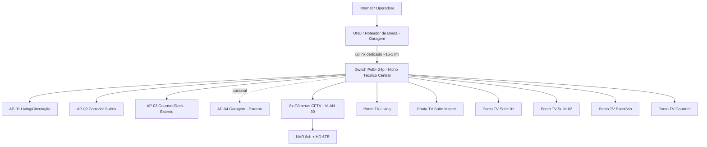

# Escopo Técnico — Rede Wi-Fi, CFTV e Cabeamento Estruturado (Pontos Lógicos para TVs)

**Projeto:** Residência Swiss J26 — Pavimento Térreo
**Proprietário:** Patrick de Freitas Alves (CPF 648.736.682-04)
**Endereço:** Estrada do Calafate, Condomínio Swiss Parque, Rua Fribourg, Quadra J, Lote 26 — Rio Branco/AC
**Projeto arquitetônico:** Marcos Diniz Engenharia (Eng. Francisco Marcos Diniz Fernandes — CREA 0120271206) / Desenho: Juliano Bandeira — Prancha 01/04, Junho/2026
**Documentos-base analisados:**
- `projeto-arquitetonico/PROJETO_SWISS_J26_PATRICK_PAV_TERREO.pdf` (planta baixa técnica, planta de situação, quadro de esquadrias e quadro de áreas)
- `simulacoes/simulacao_wifi_heatmap_rssi.png` e `simulacao_wifi_heatmap_cobertura.png` (simulações preliminares de cobertura de sinal/RF sobre a planta)

**Elaborado por:** Engenharia de Redes (perfil CCNP/CWNA) — revisão de escopo
**Data:** 18/09/2026

> Observação: a planta fornecida cobre apenas o **pavimento térreo**. Caso exista pavimento superior, este escopo deve ser complementado com um levantamento adicional (pontos de Wi-Fi/CFTV/TV do 1º pavimento e verticalização do backbone).

---

## 1. Levantamento do local

| Item | Valor |
|---|---|
| Terreno | 12,00 m (frente/fundo) x 30,00 m (laterais) = 360,00 m² |
| Área construída (casa térrea) | 205,76 m² |
| Piscina / Deck | 27,43 m² / 18,59 m² |
| Taxa de ocupação | 57,15% |
| Fechamentos laterais/fundos | Alvenaria, altura 2,00 a 2,20 m, e trechos em bloco de concreto permeável (vazado) |
| Orientação | Fachada Sul = acesso principal (Rua Fribourg); Fachada Norte = fundos (piscina/gourmet); Leste e Oeste = divisas laterais (~30 m cada) |

**Ambientes identificados na planta (para fins de projeto de infraestrutura):**

| Ambiente | Área | Observação para o projeto |
|---|---|---|
| Living | 16,02 m² | Ponto de TV principal |
| Cozinha/Jantar | 29,67 m² | Rota de passagem do backbone (próxima à área técnica) |
| Suíte Master + Closet | 14,04 + 10,12 m² | Ponto de TV + Wi-Fi próximo (parede em alvenaria mais espessa/fundos) |
| Suíte 01 | 12,00 m² | Ponto de TV |
| Suíte 02 | 12,96 m² | Ponto de TV |
| Escritório | 5,90 m² | Ponto de TV/monitor + dados |
| Circulação (2 trechos) | 2,65 + 5,15 m² | Rota preferencial de infraestrutura (eletrodutos/forro) e **local do nicho técnico do rack** (ver item 6.1) |
| Garagem | 27,65 m² | Câmeras de acesso veicular, ponto de AP externo sob beiral, entrada da ONU da operadora |
| Depósito | 3,54 m² | Cluster de serviço — descartado como local do rack por ficar excêntrico ao eixo de maior demanda (ver item 6.1) |
| Lavanderia / Secagem | 6,28 + 7,02 m² | Rota alternativa de cabeamento até fundos |
| Área Gourmet + Deck | 23,43 + 18,59 m² | Ponto de TV externa + AP externo |
| Piscina | 13,16 / 14,27 m² | Sem equipamentos elétricos na borda molhada (NBR 5410) |

---

## 2. Premissas de projeto

1. Cabeamento estruturado em **Cat6 U/UTP**, terminação em conectores RJ45 e patch panel Cat6 — suporta 1/2,5 Gb/s nos enlaces até 100 m (todas as distâncias internas da casa ficam abaixo de 35 m).
2. Todo ponto de Wi-Fi (AP) e de câmera é **alimentado via PoE/PoE+** a partir do switch — dispensa fonte local e nobreak individual.
3. **Backhaul cabeado**, não malha (mesh) sem fio — maior estabilidade e capacidade, especialmente por conta da alvenaria de fechamento e das paredes internas que atenuam RF.
4. Segmentação lógica por **VLANs** (rede de câmeras isolada da rede de usuários/convidados).
5. Infraestrutura externa (APs e câmeras em áreas descobertas) com **IP65/IP66** e proteção contra surto.
6. Ponto lógico de TV = 1x RJ45 Cat6 homerun até o rack (permite Smart TV cabeada, streaming box, futura ONT/roteador secundário ou soundbar em rede).

---

## 3. Projeto de Rede Wi-Fi

### 3.1 Leitura das simulações fornecidas

A simulação de RSSI (`simulacao_wifi_heatmap_rssi.png`) e a de cobertura (`simulacao_wifi_heatmap_cobertura.png`) confirmam o esperado pela geometria do imóvel: a casa é **estreita e muito comprida (12 x 30 m)**, com paredes de alvenaria dividindo suítes, closet e área de serviço. Um único AP central não sustenta -65 dBm nas duas extremidades (fundos/piscina x frente/garagem) nem atravessa bem as paredes das suítes com boa relação sinal-ruído para 5 GHz. As zonas de sombra mais críticas identificadas:
- Suíte Master / Closet (extremo fundos, várias paredes entre o AP único e o cômodo);
- Área Gourmet/Deck/Piscina (ambiente externo, sem obstrução, mas distante do AP frontal);
- Depósito/Lavanderia/Secagem (paredes de alvenaria + posição de canto).

### 3.2 Solução proposta — Access Points

| AP | Local de instalação | Tipo | Cobre principalmente |
|---|---|---|---|
| AP-01 | Forro do Living/Circulação central | Teto, Wi-Fi 6 indoor (ex.: UniFi U6-Pro / U6-Lite) | Living, Cozinha/Jantar, Circulação, Escritório |
| AP-02 | Forro do corredor das suítes (entre Suíte 01/02 e Suíte Master) | Teto, Wi-Fi 6 indoor | Suíte Master, Closet, Suíte 01, Suíte 02 e respectivos BWCs |
| AP-03 | Sob o beiral da Área Gourmet (fundos, fachada norte) | Externo, IP65, Wi-Fi 6 (ex.: UniFi U6-Mesh / U6-IW) | Gourmet, Deck, Piscina, quintal |
| AP-04 *(opcional)* | Sob o beiral próximo à Garagem (fachada sul) | Externo, IP65 | Garagem, acesso de veículos/pedestres, reforço de sinal na rua/portão |

- **AP-04** é opcional para o primeiro momento; recomendado caso o proprietário utilize a garagem/entrada como área de convivência ou precise de sinal no portão para interfone/automação.
- Todos os APs em **cabeamento dedicado** (não em cascata via outro AP) para evitar gargalo.

### 3.3 Parâmetros de RF (CWNA)

| Parâmetro | Configuração recomendada |
|---|---|
| Bandas | Dual-band 2,4 GHz / 5 GHz (Wi-Fi 6 preferencial, retrocompatível 6 GHz se o roteador de borda suportar) |
| Canais 5 GHz | 36/44/149/157 (não sobrepostos), largura de canal 40/80 MHz conforme densidade de vizinhos no condomínio |
| Canais 2,4 GHz | 1/6/11, potência reduzida (~30-40% da máxima) para não competir com o 5 GHz e reduzir interferência entre APs |
| Potência de transmissão | Ajustada por AP para overlap de ~15-20% entre células (evitar "sticky clients") |
| Roaming | 802.11k/v/r habilitado, mesmo SSID/segurança em todos os APs |
| SSIDs | `Residencia-Patrick` (rede principal, WPA2/WPA3-Personal), `Residencia-IoT` (VLAN isolada), `Residencia-Visitantes` (VLAN convidados, isolamento de cliente ativado) |

---

## 4. Projeto de CFTV

### 4.1 Perímetro e pontos de câmera

Baseado no layout já esboçado nas simulações (8 posições ao longo do perímetro), o escopo consolida-se em **8 câmeras externas fixas**, priorizando cobertura de muros, acessos e área de lazer, com sobreposição de campo de visão nos cantos:

| Câmera | Posição | Fachada | Cobertura |
|---|---|---|---|
| CAM-01 | Canto Noroeste | Norte/Oeste | Piscina, fundo do lote, muro oeste (trecho fundos) |
| CAM-02 | Canto Nordeste | Norte/Leste | Piscina/Gourmet, muro leste (trecho fundos) |
| CAM-03 | Muro Oeste, altura da Suíte Master/Circulação | Oeste | Corredor lateral oeste (trecho central) |
| CAM-04 | Muro Leste, altura das Suítes 01/02 | Leste | Corredor lateral leste (trecho central) |
| CAM-05 | Muro Oeste, altura da Lavanderia/Depósito | Oeste | Corredor lateral oeste (trecho sul), acesso de serviço |
| CAM-06 | Muro Leste, altura do Escritório | Leste | Corredor lateral leste (trecho sul) |
| CAM-07 | Canto Sudoeste | Sul/Oeste | Acesso de veículos, garagem, portão |
| CAM-08 | Canto Sudeste | Sul/Leste | Acesso de pedestres, calçada, Rua Fribourg |

### 4.2 Especificação técnica das câmeras

| Parâmetro | Especificação |
|---|---|
| Resolução | Mínimo 4 MP (bullet varifocal para muros/perímetro; turret/dome para cantos com campo mais amplo) |
| Lente | Varifocal 2,8–12 mm nas de perímetro (CAM-03/04/05/06); fixa 2,8 mm de maior ângulo nos cantos (CAM-01/02/07/08) |
| IR / baixa luminosidade | IR real de 30–40 m (compatível com a profundidade de 30 m do lote) + modo color low-light |
| Alimentação | PoE (802.3af/at), sem fonte local |
| Proteção | IP66/IK10, instalação sob projeção do beiral (evita incidência direta de chuva) |
| Compressão | H.265/H.265+ |

### 4.3 Gravação (NVR) e armazenamento

- **NVR 8 canais PoE** (portas suficientes para as 8 câmeras, com 1–2 portas de expansão para câmeras internas futuras, ex.: área de serviço/garagem interna).
- Cálculo de armazenamento (referência, 4 MP / H.265+):
  - Gravação contínua 24/7: ≈ 35–45 GB/câmera/dia → **8 câmeras ≈ 300–360 GB/dia**.
  - Gravação por detecção de movimento/pessoas (recomendado): reduz para **~30–40% do valor contínuo**, ou seja, ≈ 100–140 GB/dia para as 8 câmeras.
- **Recomendação:** 1x HD 6 TB (ou 2x 4 TB em RAID 1 para redundância) → retenção efetiva de **30–45 dias** com gravação por evento/movimento, ajustável.
- Acesso remoto via app do fabricante do NVR, com VPN ou P2P seguro (evitar exposição direta de portas na internet).

### 4.4 Observações de conformidade

- Nenhuma câmera deve ter campo de visão voltado para o interior de residências vizinhas — ajustar ângulo/máscaras de privacidade nas CAM-01/02/07/08 (cantos).
- Câmeras não devem monitorar a lâmina d'água da piscina de forma a caracterizar área de intimidade caso existam vestiários/trocadores próximos — restringir campo de visão à borda/acesso, não à área de estar íntima.

---

## 5. Cabeamento Estruturado — Pontos Lógicos para TVs

| Ambiente | Ponto de TV (RJ45 Cat6) | Observação |
|---|---|---|
| Living | 1x | Ponto principal, próximo a futura bancada/painel de TV |
| Suíte Master | 1x | Junto à previsão de painel de TV |
| Suíte 01 | 1x | — |
| Suíte 02 | 1x | — |
| Escritório | 1x | Pode acumular função de ponto de dados (PC/impressora) |
| Área Gourmet | 1x | Uso externo coberto (beiral), caixa de sobrepor com tampa |
| **Total** | **6 pontos** | Expansível (Deck/Piscina como ponto opcional nº 7) |

- Todos os pontos em **topologia home-run** (um cabo dedicado por ponto, sem emendas), origem no rack (ver definição de local otimizado no item 6.1).
- Distância máxima estimada, já com o rack reposicionado (item 6.1): **≈ 17–19 m** até os pontos mais afastados (Suíte Master, Gourmet, cantos de fundos) — contra ≈26–28 m na posição inicial (Depósito). Segue dentro do limite de 100 m do Cat6 com folga confortável.
- Caminhamento sugerido: eletrodutos embutidos em laje/contrapiso acompanhando as Circulações (2,65 m² e 5,15 m²), que atravessam o eixo da casa de norte a sul — rota natural para o backbone e também o corredor onde fica o novo nicho técnico.
- Cada ponto de TV também deve prever **1 tomada elétrica dedicada** ao lado (já usual em projeto elétrico), mas isso está fora do escopo deste documento de redes.

---

## 6. Infraestrutura Passiva / Rack

### 6.1 Definição do local do rack — otimização de metragem de cabo

A posição de um rack residencial não deve ser escolhida pela conveniência do cômodo (ex.: "cabe no depósito"), e sim pelo **ponto que minimiza a soma das distâncias a todos os pontos ativos** (APs, câmeras, TVs) — em termos de rede, o rack deve ficar o mais próximo possível da **mediana da demanda de cabeamento**, não de uma das extremidades do imóvel.

A casa tem 30 m de profundidade e formato retangular estreito, com os pontos de rede distribuídos ao longo de todo esse eixo:

- Extremo sul (~0–5 m): Garagem, acesso de veículos/pedestres, 2 câmeras de canto (CAM-07/08), entrada da concessionária (ONU).
- Trecho sul-central (~5–9 m): Depósito, Lavanderia, Secagem, Escritório — cluster de serviço, 2 câmeras (CAM-05/06), 1 ponto de TV (Escritório).
- Trecho central (~9–18 m): Living, Cozinha/Jantar, Circulação, Suíte 01, Suíte 02 — **maior concentração de pontos**: AP-01, AP-02, 2 câmeras (CAM-03/04), 3 pontos de TV (Living, Suíte 01, Suíte 02).
- Trecho norte (~18–26 m): Suíte Master, Closet, BWC — AP-02 (extensão), 1 ponto de TV.
- Extremo norte (~26–30 m): Piscina, Deck, Gourmet — AP-03, 2 câmeras de canto (CAM-01/02), 1 ponto de TV.

**Local inicialmente cogitado (Depósito, ~8 m do extremo sul):** fica próximo apenas do cluster de serviço e da garagem. Para todos os pontos do bloco de suítes e da área de piscina/gourmet — que são justamente os mais numerosos e mais distantes — o cabo precisa atravessar quase toda a casa (~19 a 28 m). Resultado: maior metragem total de Cat6 (estimativa ≈ 160 m só de componente longitudinal, sem contar reservas de subida/descida).

**Local recomendado:** um **nicho técnico embutido na parede do corredor central de circulação**, no trecho que liga a Suíte 01/02 ao acesso da Suíte Master (~15–17 m do extremo sul, aproximadamente o ponto médio real da casa considerando a distribuição dos pontos, não apenas a metragem do terreno). Esse ponto:

- É a **mediana estatística** das distâncias de todos os 17 pontos ativos (TVs + APs + câmeras) — matematicamente, o ponto que minimiza a soma total dos comprimentos de cabo é a mediana, não o centro geométrico nem uma das pontas.
- Reduz a distância máxima a qualquer ponto de ~26–28 m para **~17–19 m**.
- Reduz a metragem total estimada de Cat6 de ~160 m para **~140 m** (≈ 14% de economia), considerando apenas os 17 pontos internos/perimetrais (sem uplink).
- Fica a meio caminho entre o bloco social (Living/Cozinha) e o bloco íntimo (suítes), que concentram o maior número de dispositivos simultâneos (TVs 4K, streaming, consoles) — menor latência de comutação para o tráfego mais pesado.

**Trade-off a considerar:** a entrada da concessionária (ONU/fibra) normalmente chega pela fachada sul, perto da garagem. Deslocar o rack para o centro da casa exige **1 cabo de uplink dedicado mais longo** (ONU → rack central, ~15–17 m) em vez de a ONU ficar ao lado do rack. Esse é um custo de apenas 1 cabo a mais, compensado pela redução em **17 outros cabos** que passam a ser mais curtos — a troca é favorável.

**Alternativa caso o cliente exija um cômodo fechado (em vez de nicho embutido):** usar o **Closet Master** (10,12 m², ~20–22 m do extremo sul) como segunda opção — ainda bem mais central que o Depósito (distância máxima ~19 m), com a vantagem de já ser um espaço fechado e privativo, sem necessidade de obra para embutir nicho. Fica ligeiramente pior que o nicho central, mas é a melhor opção "pronta" sem alterar a alvenaria.

| Local candidato | Posição (eixo sul→norte) | Distância máx. a um ponto | Metragem total estimada (Cat6, 17 pontos) | Observação |
|---|---|---|---|---|
| Depósito *(descartado)* | ~8 m | ~26–28 m | ~160 m | Só é bom para garagem/serviço; penaliza suítes e piscina/gourmet |
| **Nicho técnico central (recomendado)** | ~15–17 m | ~17–19 m | **~140 m** | Menor metragem total; requer nicho embutido na circulação |
| Closet Master *(alternativa sem obra)* | ~20–22 m | ~19–21 m | ~148 m | Espaço já fechado, mas ligeiramente mais longe do cluster sul |

**Local proposto (definitivo):** nicho técnico embutido de 9U–12U na parede da Circulação central, entre a Suíte 01/02 e o acesso à Suíte Master, com porta ventilada embutida (acabamento no nível da parede).

| Item | Especificação | Qtde |
|---|---|---|
| Rack/nicho embutido | 9U–12U, com organizadores, porta ventilada | 1 |
| Patch panel Cat6 24 portas | Terminação de todos os pontos (TVs, APs, câmeras) | 1 |
| Switch PoE+ Gerenciável | 24 portas (mín. 4 SFP/PoE budget compatível com 4 APs + 8 câmeras) | 1 |
| Cabo de uplink dedicado (ONU/garagem → nicho central) | Cat6 ou fibra, ~15–17 m | 1 |
| Switch/roteador de borda | Conforme operadora (ONU/roteador), permanece junto à entrada na garagem, interligado por uplink | 1 (existente/fornecido pela operadora) |
| Nobreak | 1 kVA, para nicho + patch/switch | 1 |
| NVR 8 canais PoE + HD 6TB | Conforme item 4.3 — pode ficar no nicho central ou próximo à garagem (câmeras Sul), avaliar em campo | 1 |

### Capacidade de portas do switch (dimensionamento)

- 4x AP Wi-Fi
- 8x Câmeras CFTV
- 6x Pontos de TV
- 1x Uplink para roteador/ONU
- 1x NVR
- **Total ≈ 20 portas utilizadas** → switch de 24 portas atende com folga para expansão (câmera interna adicional, AP-04, ponto de Deck/Piscina).

---

## 7. Segmentação lógica (VLANs)

| VLAN | Uso | Isolamento |
|---|---|---|
| VLAN 10 | Rede confiável (usuários, notebooks, celulares) | Acesso total à internet e recursos locais |
| VLAN 20 | IoT / Automação | Sem acesso a VLAN 10, apenas internet |
| VLAN 30 | CFTV (câmeras + NVR) | Sem acesso à internet direto; apenas gerenciamento local/VPN |
| VLAN 40 | Visitantes (SSID convidados) | Isolamento de cliente, apenas internet |
| VLAN 50 | Pontos de TV / Streaming | Acesso à internet + VLAN 10 controlado (para casting, se desejado) |

---

## 8. Diagrama lógico da rede

---

## 9. Lista de Materiais (BOM) — resumo

| Item | Qtde |
|---|---|
| Access Point Wi-Fi 6 indoor (teto) | 2 |
| Access Point Wi-Fi 6 externo (IP65) | 1 (+1 opcional) |
| Câmera IP bullet varifocal 4MP PoE | 4 |
| Câmera IP turret/dome 4MP PoE | 4 |
| NVR 8 canais PoE | 1 |
| HD para NVR (6TB ou 2x4TB) | 1–2 |
| Switch PoE+ gerenciável 24p | 1 |
| Nicho/rack embutido 9U–12U (parede da circulação) | 1 |
| Patch panel Cat6 24p | 1 |
| Nobreak 1kVA | 1 |
| Cabo Cat6 U/UTP — pontos internos/perimetrais (~140 m, item 6.1) + uplink ONU→nicho (~15–17 m) + reserva de subida/curvas | ~280–310 m |
| Conector RJ45 Cat6 (keystone) | ~40 |
| Caixas de sobrepor externas (câmeras/AP externo) | 5 |

> Quantidades de cabo e conectores são estimativas de escopo; o quantitativo final depende do trajeto exato definido em obra (posição de laje/forro, prumadas). A metragem já reflete o reposicionamento do rack para o nicho técnico central (item 6.1), que reduz o consumo de cabo em relação à alternativa de instalá-lo no Depósito (~350–400 m).

---

## 10. Próximos passos

1. Validação em campo (site survey físico) das posições de AP e câmera antes da passagem de eletrodutos, confirmando alturas de pé-direito e posição real do beiral.
2. Confirmação se haverá pavimento superior — se sim, complementar este escopo com pontos adicionais e verticalização do rack (shaft técnico).
3. Confirmação em campo do ponto exato de entrada da operadora (ONU) na garagem e viabilidade de abertura do nicho técnico embutido na parede da circulação central (item 6.1), incluindo o traçado do uplink dedicado ONU → nicho.
4. Aprovação do proprietário quanto a modelos/marcas (ex.: linha Ubiquiti UniFi, ou similar de mesma capacidade PoE/Wi-Fi 6) e política de retenção de gravação do CFTV.
