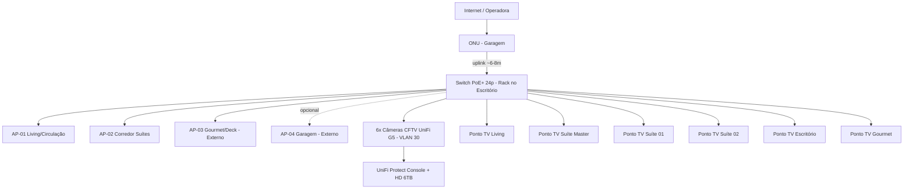

# Escopo Técnico — Rede Wi-Fi, CFTV e Cabeamento Estruturado (Pontos Lógicos para TVs)

**Projeto:** Residência Swiss J26 — Pavimento Térreo
**Proprietário:** Patrick de Freitas Alves (CPF 648.736.682-04)
**Endereço:** Estrada do Calafate, Condomínio Swiss Parque, Rua Fribourg, Quadra J, Lote 26 — Rio Branco/AC
**Projeto arquitetônico:** Marcos Diniz Engenharia (Eng. Francisco Marcos Diniz Fernandes — CREA 0120271206) / Desenho: Juliano Bandeira — Prancha 01/04, Junho/2026
**Documentos-base analisados:**
- `projeto-arquitetonico/PROJETO_SWISS_J26_PATRICK_PAV_TERREO.pdf` (planta baixa técnica, planta de situação, quadro de esquadrias e quadro de áreas)
- `simulacoes/simulacao_wifi_heatmap_rssi.png` e `simulacao_wifi_heatmap_cobertura.png` (simulações preliminares de cobertura de sinal/RF sobre a planta)

**Elaborado por:** Engenharia de Redes (perfil CCNP/CWNA) — revisão de escopo
**Data:** 18/09/2026

> Observação: a planta fornecida cobre apenas o **pavimento térreo**. Caso exista pavimento superior, este escopo deve ser complementado com um levantamento adicional (pontos de Wi-Fi/CFTV/TV do 1º pavimento e verticalização do backbone).

---

## 1. Levantamento do local

| Item | Valor |
|---|---|
| Terreno | 12,00 m (frente/fundo) x 30,00 m (laterais) = 360,00 m² |
| Área construída (casa térrea) | 205,76 m² |
| Piscina / Deck | 27,43 m² / 18,59 m² |
| Taxa de ocupação | 57,15% |
| Fechamentos laterais/fundos | Alvenaria, altura 2,00 a 2,20 m, e trechos em bloco de concreto permeável (vazado) |
| Orientação | Fachada Sul = acesso principal (Rua Fribourg); Fachada Norte = fundos (piscina/gourmet); Leste e Oeste = divisas laterais (~30 m cada) |

**Ambientes identificados na planta (para fins de projeto de infraestrutura):**

| Ambiente | Área | Observação para o projeto |
|---|---|---|
| Living | 16,02 m² | Ponto de TV principal |
| Cozinha/Jantar | 29,67 m² | Rota de passagem do backbone (próxima à área técnica) |
| Suíte Master + Closet | 14,04 + 10,12 m² | Ponto de TV + Wi-Fi próximo (parede em alvenaria mais espessa/fundos) |
| Suíte 01 | 12,00 m² | Ponto de TV |
| Suíte 02 | 12,96 m² | Ponto de TV |
| Escritório | 5,90 m² | Ponto de TV/monitor + dados; **local definitivo do rack/quadro de telecom** (decisão do cliente — ver item 6.1) |
| Circulação (2 trechos) | 2,65 + 5,15 m² | Rota preferencial de infraestrutura (eletrodutos/forro) até o Escritório |
| Garagem | 27,65 m² | Câmeras de acesso veicular, ponto de AP externo sob beiral, entrada da ONU da operadora (próxima ao Escritório) |
| Depósito | 3,54 m² | Cluster de serviço — considerado e descartado como local do rack (ver item 6.1) |
| Lavanderia / Secagem | 6,28 + 7,02 m² | Rota alternativa de cabeamento até fundos |
| Área Gourmet + Deck | 23,43 + 18,59 m² | Ponto de TV externa + AP externo |
| Piscina | 13,16 / 14,27 m² | Sem equipamentos elétricos na borda molhada (NBR 5410) |

---

## 2. Premissas de projeto

1. Cabeamento estruturado em **Cat6 U/UTP**, terminação em conectores RJ45 e patch panel Cat6 — suporta 1/2,5 Gb/s nos enlaces até 100 m (todas as distâncias internas da casa ficam abaixo de 35 m).
2. Todo ponto de Wi-Fi (AP) e de câmera é **alimentado via PoE/PoE+** a partir do switch — dispensa fonte local e nobreak individual.
3. **Backhaul cabeado**, não malha (mesh) sem fio — maior estabilidade e capacidade, especialmente por conta da alvenaria de fechamento e das paredes internas que atenuam RF.
4. Segmentação lógica por **VLANs** (rede de câmeras isolada da rede de usuários/convidados).
5. Infraestrutura externa (APs e câmeras em áreas descobertas) com **IP65/IP66** e proteção contra surto.
6. Ponto lógico de TV = 1x RJ45 Cat6 homerun até o rack (permite Smart TV cabeada, streaming box, futura ONT/roteador secundário ou soundbar em rede).

---

## 3. Projeto de Rede Wi-Fi

### 3.1 Leitura das simulações fornecidas

A simulação de RSSI (`simulacao_wifi_heatmap_rssi.png`) e a de cobertura (`simulacao_wifi_heatmap_cobertura.png`) confirmam o esperado pela geometria do imóvel: a casa é **estreita e muito comprida (12 x 30 m)**, com paredes de alvenaria dividindo suítes, closet e área de serviço. Um único AP central não sustenta -65 dBm nas duas extremidades (fundos/piscina x frente/garagem) nem atravessa bem as paredes das suítes com boa relação sinal-ruído para 5 GHz. As zonas de sombra mais críticas identificadas:
- Suíte Master / Closet (extremo fundos, várias paredes entre o AP único e o cômodo);
- Área Gourmet/Deck/Piscina (ambiente externo, sem obstrução, mas distante do AP frontal);
- Depósito/Lavanderia/Secagem (paredes de alvenaria + posição de canto).

### 3.2 Solução proposta — Access Points

| AP | Local de instalação | Tipo | Cobre principalmente |
|---|---|---|---|
| AP-01 | Forro do Living/Circulação central | Teto, Wi-Fi 6 indoor (ex.: UniFi U6-Pro / U6-Lite) | Living, Cozinha/Jantar, Circulação, Escritório |
| AP-02 | Forro do corredor das suítes (entre Suíte 01/02 e Suíte Master) | Teto, Wi-Fi 6 indoor | Suíte Master, Closet, Suíte 01, Suíte 02 e respectivos BWCs |
| AP-03 | Sob o beiral da Área Gourmet (fundos, fachada norte) | Externo, IP65, Wi-Fi 6 (ex.: UniFi U6-Mesh / U6-IW) | Gourmet, Deck, Piscina, quintal |
| AP-04 *(opcional)* | Sob o beiral próximo à Garagem (fachada sul) | Externo, IP65 | Garagem, acesso de veículos/pedestres, reforço de sinal na rua/portão |

- **AP-04** é opcional para o primeiro momento; recomendado caso o proprietário utilize a garagem/entrada como área de convivência ou precise de sinal no portão para interfone/automação.
- Todos os APs em **cabeamento dedicado** (não em cascata via outro AP) para evitar gargalo.

### 3.3 Parâmetros de RF (CWNA)

| Parâmetro | Configuração recomendada |
|---|---|
| Bandas | Dual-band 2,4 GHz / 5 GHz (Wi-Fi 6 preferencial, retrocompatível 6 GHz se o roteador de borda suportar) |
| Canais 5 GHz | 36/44/149/157 (não sobrepostos), largura de canal 40/80 MHz conforme densidade de vizinhos no condomínio |
| Canais 2,4 GHz | 1/6/11, potência reduzida (~30-40% da máxima) para não competir com o 5 GHz e reduzir interferência entre APs |
| Potência de transmissão | Ajustada por AP para overlap de ~15-20% entre células (evitar "sticky clients") |
| Roaming | 802.11k/v/r habilitado, mesmo SSID/segurança em todos os APs |
| SSIDs | `Residencia-Patrick` (rede principal, WPA2/WPA3-Personal), `Residencia-IoT` (VLAN isolada), `Residencia-Visitantes` (VLAN convidados, isolamento de cliente ativado) |

---

## 4. Projeto de CFTV

### 4.1 Perímetro e pontos de câmera

> **Correção de contagem (confirmada pelo cliente):** as simulações mostram **6 câmeras Ubiquiti UniFi G5**, não 8. A versão anterior deste documento presumiu 2 câmeras adicionais nos cantos sul (portão/calçada) que não existem no layout real. A tabela abaixo reflete as 6 posições efetivamente marcadas nas imagens.

O layout já esboçado nas simulações consolida-se em **6 câmeras externas fixas, todas Ubiquiti UniFi G5 Dome** (mesmo modelo em todas as posições, mantendo padronização visual e de sobressalentes):

| Câmera | Posição | Fachada | Cobertura |
|---|---|---|---|
| CAM-01 | Canto Noroeste (fundos) | Norte/Oeste | Piscina, fundo do lote, muro oeste (trecho fundos) |
| CAM-02 | Muro Leste, altura da Suíte Master/BWC | Leste | Muro leste (trecho fundos), parte da Área Gourmet |
| CAM-03 | Muro Oeste, altura da Suíte Master/Circulação | Oeste | Corredor lateral oeste (trecho norte) |
| CAM-04 | Muro Leste / pátio, altura da Suíte 02 | Leste | Corredor lateral leste (trecho central) |
| CAM-05 | Muro Leste, altura do Escritório/Depósito | Leste | Corredor lateral leste (trecho sul), acesso de serviço |
| CAM-06 | Canto Sudoeste, próximo à Garagem | Sul/Oeste | Acesso de veículos, garagem, portão |

> **Observação de cobertura:** com apenas 6 câmeras, o **acesso de pedestres/calçada no canto sudeste** (junto à Rua Fribourg) fica sem câmera dedicada — hoje é coberto apenas indiretamente pela CAM-06. Se o acesso de pedestres for prioritário para o cliente, vale avaliar deslocar a CAM-05 ou adicionar uma 7ª câmera nesse canto; mantido como está por ora, por refletir fielmente o que já foi definido.

### 4.2 Especificação técnica das câmeras

| Parâmetro | Especificação |
|---|---|
| Modelo | Ubiquiti UniFi Protect **G5 Dome** (mesmo modelo nas 6 posições) |
| Resolução | 5 MP |
| Lente | Fixa, grande angular — adequada tanto para muro (CAM-02/03/04/05) quanto para canto (CAM-01/06) |
| IR / baixa luminosidade | IR integrado ≈ 30 m (compatível com a maior parte dos vãos do lote) |
| Alimentação | PoE (802.3af), sem fonte local |
| Proteção | IP67, instalação sob projeção do beiral quando possível |
| Compressão | H.265, gerenciada pelo UniFi Protect |

### 4.3 Gravação (UniFi Protect) e armazenamento

- As câmeras são da linha **UniFi Protect**, portanto **não funcionam com um NVR ONVIF genérico** — é necessário um **UniFi OS Console** rodando o aplicativo Protect. Recomendação: **UniFi UNVR** (4 baias de HD, dedicado a Protect) ou, caso o roteador de borda também venha a ser UniFi, um **UniFi Dream Machine Pro/SE** (que já integra roteador + Protect em um único equipamento).
- Cálculo de armazenamento (referência de planejamento, 5 MP / H.265 — **validar o número final com a calculadora oficial de armazenamento do UniFi Protect antes de fechar a compra do HD**):
  - Gravação contínua 24/7: ≈ 45–55 GB/câmera/dia → **6 câmeras ≈ 270–330 GB/dia**.
  - Gravação por detecção de movimento/pessoas (recomendado, padrão do Protect): reduz para **~30–40% do valor contínuo**, ou seja, ≈ 80–130 GB/dia para as 6 câmeras.
- **Recomendação:** 1x HD 6 TB (ou 2x 4 TB em RAID 1 para redundância) → retenção efetiva de **30–45 dias** com gravação por evento/movimento, ajustável.
- Acesso remoto via app UniFi Protect, com acesso remoto nativo (Ubiquiti Cloud) ou VPN — evitar exposição direta de portas na internet.

### 4.4 Observações de conformidade

- Nenhuma câmera deve ter campo de visão voltado para o interior de residências vizinhas — ajustar ângulo/máscaras de privacidade nas CAM-01 e CAM-06 (cantos).
- Câmeras não devem monitorar a lâmina d'água da piscina de forma a caracterizar área de intimidade caso existam vestiários/trocadores próximos — restringir campo de visão à borda/acesso, não à área de estar íntima.

---

## 5. Cabeamento Estruturado — Pontos Lógicos para TVs

| Ambiente | Ponto de TV (RJ45 Cat6) | Observação |
|---|---|---|
| Living | 1x | Ponto principal, próximo a futura bancada/painel de TV |
| Suíte Master | 1x | Junto à previsão de painel de TV |
| Suíte 01 | 1x | — |
| Suíte 02 | 1x | — |
| Escritório | 1x | Pode acumular função de ponto de dados (PC/impressora); ponto co-localizado com o próprio rack (patch direto, sem cabo longo) |
| Área Gourmet | 1x | Uso externo coberto (beiral), caixa de sobrepor com tampa |
| **Total** | **6 pontos** | Expansível (Deck/Piscina como ponto opcional nº 7) |

- Todos os pontos em **topologia home-run** (um cabo dedicado por ponto, sem emendas), origem no rack, instalado no **Escritório** por definição do cliente (ver item 6.1).
- Distância máxima estimada a partir do Escritório: **≈ 26–29 m** até os pontos mais afastados (Suíte Master, Gourmet, cantos de fundos/piscina). Ainda dentro do limite de 100 m do Cat6, mas é a maior metragem entre as opções avaliadas (ver comparativo no item 6.1).
- Caminhamento sugerido: eletrodutos embutidos em laje/contrapiso acompanhando as Circulações (2,65 m² e 5,15 m²), que atravessam o eixo da casa de norte a sul, partindo do Escritório até o fundo do lote.
- Cada ponto de TV também deve prever **1 tomada elétrica dedicada** ao lado (já usual em projeto elétrico), mas isso está fora do escopo deste documento de redes.

---

## 6. Infraestrutura Passiva / Rack

### 6.1 Definição do local do rack

> **Decisão do cliente:** o rack será instalado no **Escritório (5,90 m²)**. Esta seção registra a análise técnica de metragem de cabo considerando esse local definido e o comparativo com as alternativas avaliadas, para que a equipe de instalação e o próprio cliente tenham visibilidade do trade-off assumido.

A casa tem 30 m de profundidade e formato retangular estreito, com os pontos de rede distribuídos ao longo de todo esse eixo:

- Extremo sul (~0–5 m): Garagem, acesso de veículos/pedestres, 1 câmera de canto (CAM-06), entrada da concessionária (ONU).
- Trecho sul-central (~5–9 m): **Escritório**, Depósito, Lavanderia, Secagem — cluster de serviço, 1 câmera (CAM-05).
- Trecho central (~9–18 m): Living, Cozinha/Jantar, Circulação, Suíte 01, Suíte 02 — **maior concentração de pontos**: AP-01, AP-02, 1 câmera (CAM-04), 3 pontos de TV (Living, Suíte 01, Suíte 02).
- Trecho norte (~18–26 m): Suíte Master, Closet, BWC — AP-02 (extensão), 2 câmeras (CAM-02/03, muros leste e oeste), 1 ponto de TV.
- Extremo norte (~26–30 m): Piscina, Deck, Gourmet — AP-03, 1 câmera de canto (CAM-01), 1 ponto de TV.

**Local definido — Escritório (~8 m do extremo sul):** por estar no mesmo cluster sul-central do Depósito, o Escritório herda o mesmo perfil de distância que aquela opção: é o ponto **mais curto para a Garagem/ONU** (uplink de concessionária mais barato, ~6–8 m) e para as câmeras CAM-05/06, porém é o **mais distante** dos pontos com maior concentração de demanda — bloco de suítes, corredor central e, principalmente, Piscina/Gourmet nos fundos (~26–30 m em linha de rota).

| Local candidato | Posição (eixo sul→norte) | Distância máx. a um ponto | Metragem total estimada (Cat6, 16 pontos) | Observação |
|---|---|---|---|---|
| **Escritório (definido pelo cliente)** | ~8 m | **~26–29 m** (Suíte Master / canto de fundos) | **~175 m** | Uplink da ONU mais curto (~6–8 m); é o cômodo mais distante do bloco de suítes e da piscina/gourmet |
| Depósito *(avaliado e descartado)* | ~8 m | ~26–28 m | ~170 m | Perfil de distância equivalente ao Escritório (mesmo cluster); sem vantagem sobre o Escritório, que já é um ambiente de uso do cliente |
| Nicho técnico central (circulação) | ~15–17 m | ~13–14 m | ~120 m | Menor metragem total possível, mas exige obra (nicho embutido) e uplink de ONU mais longo (~15–17 m) |
| Closet Master | ~20–22 m | ~19–21 m | ~140 m | Espaço fechado, mas distante do cluster sul (garagem/ONU) |

Ou seja: em relação à opção de menor metragem total (nicho técnico central), instalar no Escritório representa **~55 m a mais de cabo Cat6** no total (~175 m vs. ~120 m) e cerca de **13-15 m a mais na distância máxima** (Suíte Master/fundos). Ainda assim, todas as distâncias permanecem **muito abaixo do limite de 100 m** por segmento Cat6, então não há qualquer restrição técnica — é uma diferença de custo de material (mais alguns metros de cabo, ainda dentro de 1 única caixa de 305m — ver item 9), não de viabilidade.

**Mitigações recomendadas para reduzir o impacto da maior distância aos fundos (mantendo o rack no Escritório):**

1. Priorizar o trajeto pelas Circulações (2,65 m² e 5,15 m²), que formam a rota mais reta possível entre o Escritório e o bloco de suítes/piscina — evita desvios desnecessários.
2. Para os pontos mais distantes (AP-03 no Gourmet, TV Gourmet, CAM-01/02 nos cantos de fundos), usar cabo Cat6 de melhor blindagem (F/UTP) se houver trechos paralelos a fiação elétrica de potência, já que o percurso é mais longo e mais exposto a ruído.
3. Caso o cliente aceite futuramente, um pequeno switch PoE não gerenciado de 5–8 portas embutido na circulação central pode atender AP-02 + suítes + CAM-03/04 com runs curtos, com apenas 1 uplink até o rack no Escritório — reduz a quantidade de cabo longo sem abandonar o rack definido. *(Opcional — fora do escopo padrão home-run, avaliar com o cliente se compensa a complexidade extra.)*

### 6.2 Especificação do rack

| Item | Especificação | Qtde |
|---|---|---|
| Rack de parede / gabinete fechado | 9U–12U, com organizadores, ventilação forçada (o Escritório é ambiente de permanência — priorizar modelo silencioso) | 1 |
| Patch panel Cat6 24 portas | Terminação de todos os pontos (TVs, APs, câmeras) | 1 |
| Switch PoE+ Gerenciável | 24 portas (mín. 4 SFP/PoE budget compatível com 4 APs + 8 câmeras) | 1 |
| Cabo de uplink (ONU/garagem → rack no Escritório) | Cat6, ~6–8 m | 1 |
| Switch/roteador de borda | Conforme operadora (ONU/roteador) — pode migrar da garagem para dentro do próprio rack do Escritório, dado o percurso curto | 1 (existente/fornecido pela operadora) |
| Nobreak | 1 kVA, para rack + roteador de borda | 1 |
| UniFi Protect Console (UNVR ou Dream Machine Pro/SE) + HD 6TB | Conforme item 4.3 — instalar no rack do Escritório | 1 |

> Recomenda-se prever circuito elétrico dedicado (tomada exclusiva) no Escritório para o rack/nobreak, além de ventilação mínima no gabinete (o cômodo é fechado e de uso frequente).

### Capacidade de portas do switch (dimensionamento)

- 4x AP Wi-Fi
- 6x Câmeras CFTV
- 6x Pontos de TV
- 1x Uplink para roteador/ONU
- 1x UniFi Protect Console
- **Total ≈ 18 portas utilizadas** → switch de 24 portas atende com folga para expansão (câmera adicional no canto sudeste, AP-04, ponto de Deck/Piscina).

---

## 7. Segmentação lógica (VLANs)

| VLAN | Uso | Isolamento |
|---|---|---|
| VLAN 10 | Rede confiável (usuários, notebooks, celulares) | Acesso total à internet e recursos locais |
| VLAN 20 | IoT / Automação | Sem acesso a VLAN 10, apenas internet |
| VLAN 30 | CFTV (câmeras + NVR) | Sem acesso à internet direto; apenas gerenciamento local/VPN |
| VLAN 40 | Visitantes (SSID convidados) | Isolamento de cliente, apenas internet |
| VLAN 50 | Pontos de TV / Streaming | Acesso à internet + VLAN 10 controlado (para casting, se desejado) |

---

## 8. Diagrama lógico da rede

---

## 9. Lista de Materiais (BOM) — resumo

| Item | Qtde |
|---|---|
| Access Point Wi-Fi 6 indoor (teto) | 2 |
| Access Point Wi-Fi 6 externo (IP65) | 1 (+1 opcional) |
| Câmera Ubiquiti UniFi Protect G5 Dome | 6 |
| UniFi Protect Console (UNVR ou Dream Machine Pro/SE) | 1 |
| HD para o Protect Console (6TB ou 2x4TB) | 1–2 |
| Switch PoE+ gerenciável 24p | 1 |
| Rack de parede/gabinete 9U–12U (Escritório) | 1 |
| Patch panel Cat6 24p | 1 |
| Nobreak 1kVA | 1 |
| Cabo Cat6 U/UTP — 16 pontos (4 Wi-Fi + 6 CFTV + 6 TV) a partir do Escritório + uplink ONU→rack + margem de instalação | 1 caixa de 305m (ver detalhamento na planilha de materiais) |
| Conector RJ45 Cat6 (keystone) | ~20 |
| Caixas de sobrepor externas (câmeras/AP externo) | 4 |

> Quantidades de cabo e conectores são as usadas na planilha de materiais (`Lista_de_Materiais_Swiss_J26.xlsx`), que já soma automaticamente a metragem por sistema (Wi-Fi/CFTV/TV) na aba Memória de Cálculo. O rack no Escritório consome cerca de 55 m a mais de Cat6 do que a alternativa de menor metragem (nicho técnico central), em troca de manter o equipamento em um cômodo já existente e sem necessidade de obra na alvenaria — mesmo assim, 1 única caixa de 305m atende com folga.

---

## 10. Próximos passos

1. Validação em campo (site survey físico) das posições de AP e câmera antes da passagem de eletrodutos, confirmando alturas de pé-direito e posição real do beiral.
2. Confirmação se haverá pavimento superior — se sim, complementar este escopo com pontos adicionais e verticalização do rack (shaft técnico).
3. Confirmação em campo do ponto exato de entrada da operadora (ONU) na garagem e do trajeto do uplink ONU → rack no Escritório (item 6.1), além de verificar espaço/ventilação disponível no Escritório para o gabinete.
4. Aprovação do proprietário quanto a modelos/marcas (ex.: linha Ubiquiti UniFi, ou similar de mesma capacidade PoE/Wi-Fi 6) e política de retenção de gravação do CFTV.
